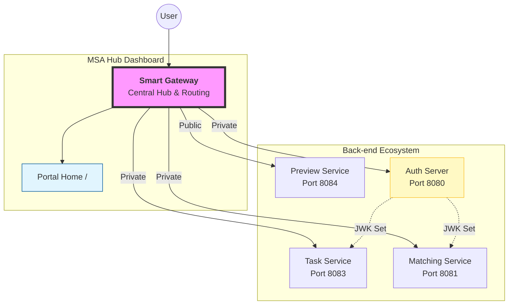

### 🚀 프로젝트 로드맵

```mermaid
graph LR
    %% 단계 정의
    Step1(<b>Phase 1. 문제 정의</b><br/>운영 비효율 진단<br/>아키텍처 설계)
    Step2(<b>Phase 2. 엔진 구축</b><br/>Auth Server 구현<br/>보안 프로토콜 적용)
    Step3(<b>Phase 3. 통합</b><br/>SSO 통합 검증<br/>관리자 반복로그인 제거)
    Step3.5(<b>Phase 3.5. 운영 최적화</b><br/>임계치 도달<br/>인증 안정성 확보)
    Step4(<b>Phase 4. 비즈니스 확장</b><br/>MSA 대시보드 구축<br/>Sec 7.0 마이그레이션)
    Step5(<b>Phase 5. 클라우드 배포</b><br/>Render 배포<br/>운영 환경 구성)

    %% 흐름 연결
    Step1 --> Step2
    Step2 -->Step3
    Step3 -->Step3.5
    Step3.5 -->Step4
    Step4 -->Step5

    %% 스타일링
    style Step1 fill:#ffffff,color:#000000,stroke:#455a64,stroke-width:2px
    style Step2 fill:#ffffff,color:#000000,stroke:#455a64,stroke-width:2px
    style Step3 fill:#ffffff,color:#000000,stroke:#455a64,stroke-width:2px
    style Step3.5 fill:#ffffff,color:#000000,stroke:#455a64,stroke-width:2px
    style Step4 fill:#ffffff,color:#000000,stroke:#455a64,stroke-width:2px
    style Step5 fill:#ffffff,color:#000000,stroke:#f57c00,stroke-width:2px

    %% 하단 주석 대신 방향성 표시
    classDef default font-family:Arial,font-size:13px;

    %% 클릭 이벤트 추가
    click Step1 "./docs/phase/phase1.md"
    click Step2 "./docs/phase/phase2.md"
    click Step3 "./docs/phase/phase3.md"
    click Step3.5 "./docs/phase/phase3_5.md"
    click Step4 "./docs/phase/phase4.md"
```

---

### 🌐 통합 포털 아키텍처

---
### 🧾 프로젝트 목표

```mermaid
graph LR
%% 1. 과거 상태 (Legacy)
    subgraph Legacy [Before: 파편화된 서비스]
        direction TB
        P1[프로젝트 A] --- DB1[(회원DB)]
        P2[프로젝트 B] --- DB2[(회원DB)]
        Admin1((관리자)) -.->|중복 로그인/관리| P1
        Admin1 -.->|중복 로그인/관리| P2
    end

%% 2. 현재 구축 단계 (Implementation)
    subgraph Current [Current: 통합 프로세스 구축]
        direction TB
        S1[<b>1. 인증 통합</b><br/>중앙 인증 엔진 구축]
        S2[<b>2. 권한 위임</b><br/>OAuth2 표준 적용]
        S3[<b>3. 연동 규격화</b><br/>로그인 흐름 일원화]

        S1 --> S2 --> S3
    end

%% 3. 최종 지향점 (Target)
    subgraph Target [Target: 통합 인증 생태계]
        direction TB
        AuthS[<b>통합 인증 서버</b>]
        AppA[서비스 A]
        AppB[서비스 B]
        AppC{{<b>신규 서비스 C</b>}}

        AuthS --- AppA
        AuthS --- AppB
        AuthS --- AppC

        Admin2((관리자)) ==>|Single Sign-On| AuthS
    end

%% 연결선
    Legacy -.->|인프라 개선| Current
    Current -.->|생태계 확장| Target

%% 스타일링
    style S1 fill:#333,color:#fff,stroke:#000
    style S2 fill:#333,color:#fff,stroke:#000
    style S3 fill:#333,color:#fff,stroke:#000
    style AuthS fill:#333,stroke:#333,stroke:#000,stroke-width:2px
    style Target fill:#333,color:#fff,stroke:#fff,stroke-dasharray: 5 5
```

---
* Legacy: 각 서비스별 독립된 DB와 인증 체계로 인해 관리 업무가 비례해서 증가하던 단계입니다.
* Current: 프로젝트를 통해 파편화된 인증을 중앙 서버로 결집하고 표준을 세우는 단계입니다.
* Target: 관리자는 단 한 번의 인증으로 모든 권한을 통제하며, 신규 서비스는 개발 공수 없이 즉시 전사 인증 생태계에 합류하는 단계입니다.

---
### 📈 개발 현황 (Latest Progress)

#### Phase 4 완료 항목

| 분류 | 항목 | 상태 |
| :--- | :--- | :---: |
| **Auth UX** | 커스텀 로그인 페이지 (`/login.html`) — Spring 기본 화면 대체 | ✅ |
| **Auth UX** | 커스텀 회원가입 페이지 (`/signup.html`) | ✅ |
| **소셜 로그인** | Google OAuth2 로그인 버튼 및 연동 (`/oauth2/authorization/google`) | ✅ |
| **JWT 쿠키** | 로그인 성공 시 `accessToken` / `refreshToken` HttpOnly 쿠키 발급 | ✅ |
| **JWT 쿠키** | `FormLoginSuccessHandler` / `OAuth2SuccessHandler` — 쿠키 기반 리다이렉트 | ✅ |
| **Gateway 연동** | `CookieToAuthorizationFilter` — 쿠키 → `Authorization: Bearer` 변환 | ✅ |
| **Gateway 연동** | 대시보드 인증 상태 감지 — 로그아웃 버튼 활성화 | ✅ |
| **MSA** | `Spring Security 7.0` + OIDC Authorization Server 마이그레이션 | ✅ |
| **MSA** | `forward-headers-strategy: framework` — 프록시 헤더 처리 | ✅ |
| **트래픽 제어** | 가상 대기열 (Redis ZSET 기반) 구현 | ✅ |
| **트래픽 제어** | IP Rate Limit (Bucket4j) | 📅 |
| **트래픽 제어** | Brute-force 방어 | 📅 |

#### Phase 5 준비 항목

| 분류 | 항목 | 상태 |
| :--- | :--- | :---: |
| **배포 준비** | 하드코딩 제거 — 환경변수 분리 (`GATEWAY_URL`, `OAUTH2_CLIENT_SECRET` 등) | ✅ |
| **배포 준비** | `application-dev.yaml` / `application.yaml` 환경 분리 | ✅ |
| **배포** | Render 클라우드 배포 | 🔄 |

> ✅ 완료 &nbsp;&nbsp; 🔄 진행 중 &nbsp;&nbsp; 📅 예정

---
### 📑 Core Documentation
상세 내역은 아래 문서들을 참고하세요.
*   **[SECURITY_UPGRADE_REPORT.md](./docs/auth/SECURITY_UPGRADE_REPORT.md)**: Spring Security 7.0 마이그레이션 및 AI 기반 분석 리포트.
*   **[PROJECT_MANIFESTO.md](./docs/PROJECT_MANIFESTO.md)**: 전체 프로젝트의 존재 이유와 검증 시나리오.
*   **[TRAFFIC_CONTROL_STRATEGY.md](./docs/TRAFFIC_CONTROL_STRATEGY.md)**: Phase 4의 핵심 전략인 '차단과 대기'의 상세 설계.
*   **[DECISION_LOG_WHY.md](./docs/DECISION_LOG_WHY.md)**: 기술 선택 시의 고민과 트레이드오프 기록.
*   **[PHASE 4 Architecture](./docs/architecture/phase4_architecture.md)**: 스마트 게이트웨이의 데이터 흐름도.
---
### 🛠️ Tech Stack
- **Language**: Kotlin 2.2 / Java 21
- **Framework**: Spring Boot 4.0 (Latest Bleeding Edge)
- **Security**: **Spring Security 7.0** (OAuth2 Authorization Server, OIDC)
- **Architecture**: MSA (Gateway, Auth, Task, Matching, Preview)
- **Database**: PostgreSQL / H2 (Development)
- **Testing**: JUnit 5, Mockito-Kotlin

---
**Main Entrance**: [http://localhost:8000/](http://localhost:8000/) (Gateway Portal)
