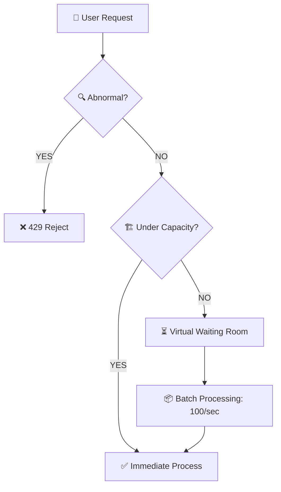

# 🛡️ Traffic Control Strategy: Filter & Queue

## 1. 🎯 전략의 핵심 (The Core)
대용량 트래픽 상황에서 모든 요청을 즉시 처리하려다 서버가 죽는 것을 방지합니다. 
우리는 들어오는 트래픽을 **'비정상(Abnormal)'**과 **'정상(Normal)'**으로 엄격히 구분하여 대응합니다.

---

## 2. ✂️ Filtering: 비정상 트래픽 즉시 차단 (Cutting)
매크로, 봇(Bot), 디도스 공격 등 시스템을 마비시키는 요청은 대기열에 담지 않고 즉시 거부합니다.

*   **판단 기준**: 동일 IP에서 1초 내 N회 이상의 요청, 혹은 짧은 시간 내 수백 건의 로그인 실패 발생 시.
*   **기술적 수단**: `Bucket4j` (In-memory/Redis 연동).
*   **결과**: `429 Too Many Requests` 반환. 서버 자원 소모를 최소화하여 다음 단계의 '정상 유저'를 보호함.

---

## 3. ⏳ Queuing: 정상 트래픽 줄 세우기 (Waiting Room)
정상적인 유저의 요청이지만 현재 서버가 처리 가능한 수용량(Capacity)을 초과한 경우, 요청을 실패시키지 않고 **'대기 순번'**을 부여합니다.

*   **메커니즘 (Virtual Waiting Room)**:
    1.  유저가 로그인 시도 시, 서버 부하가 높으면 **Redis Sorted Set**에 해당 유저를 담고 대기 순번(Ranking)을 응답.
    2.  서버는 백그라운드에서 일정 단위(Batch, 예: 100명씩)로 대기열 유저를 처리 로직으로 이동시킴.
    3.  클라이언트는 본인의 순번을 확인하며 기다리다, 순서가 되면 실제 로그인 프로세스로 진입.

---

## 4. 📈 시각적 흐름 (Traffic Shaping)

---

## 5. 💡 왜 이것을 하는가? (The Goal)
*   **서버 보호**: 서버가 감당할 수 있는 만큼만 일을 함으로써 '로그인 전체 마비' 방지.
*   **사용자 경험**: "안되는 것(무한 로딩)"보다 "조금 기다려야 한다는 확신(순번)"을 제공.
*   **신뢰성**: 갑작스러운 트래픽 폭주 시에도 비즈니스 로직(인증)의 무결성을 지킴.

---
**관련 Phase**: Phase 4 (트래픽 제어 및 대기열 관리)
