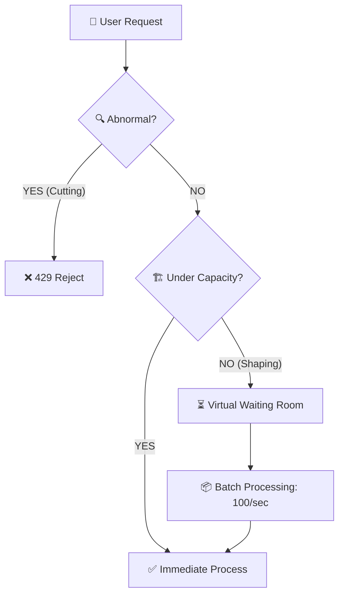

# ⚔️ Traffic Control Strategy: Shaping & Cutting

## 1. 🎯 전략적 목표 (The Mission)
우리의 전장은 '10만 명의 동시 접속'입니다. 이 폭풍 속에서 서버가 침몰하지 않기 위해, 우리는 들어오는 트래픽을 **'지배'**해야 합니다. 무조건 수용하는 것이 아니라, 수용 가능한 형태로 트래픽의 모양을 빚어내는 것(Shaping)이 이 전략의 핵심입니다.

---

## 2. ✂️ Tactical Cutting: 비정상 트래픽 즉시 사살
시스템을 마비시키는 '독'이 되는 트래픽은 대기열이라는 자원조차 소모하게 두지 않고 입구에서 즉시 사살합니다.

*   **타겟**: 매크로, 봇(Bot), 브루트 포스 공격 등 비정상적인 반복 요청.
*   **전술적 판단**: 동일 IP에서 임계치 이상의 요청 감지 시 즉각 차단.
*   **무기**: `Bucket4j` (Rate Limiter).
*   **목적**: **"엔진의 순수 가용성 보존"**. 쓰레기 요청을 처리하느라 CPU가 낭비되는 것을 막아, 정상 유저를 위한 자원을 1%라도 더 확보함.

---

## 3. ⏳ Strategic Shaping: 정상 유저의 줄 세우기 (Waiting Room)
정상 유저라 할지라도 서버의 수용량을 넘어서는 순간 '독'이 됩니다. 우리는 이 트래픽을 서버가 소화 가능한 속도로 **재구성(Shaping)**합니다.

*   **타겟**: 서버 수용량(Capacity)을 초과하여 유입되는 정상 유저들.
*   **메커니즘 (Virtual Waiting Room)**:
    1.  **Enlist**: 초과 유입 유저를 `Redis Sorted Set`에 등록하고 실시간 순번 부여.
    2.  **Wait**: 유저에게 "실패"가 아닌 "순번"을 주어 심리적 안정감을 제공하고 재시도를 억제함.
    3.  **Deploy**: 서버의 CPU 상태에 맞춰 초당 N명씩(Batch)만 전장(인증 로직)으로 투입.
*   **무기**: `Redis ZSET` 기반 가상 대기열.

---

## 4. 📈 트래픽 제어 지휘 체계 (Traffic Flow)

---

## 5. 💡 왜 이것을 하는가? (The Commander's Intent)
*   **시스템 생존**: 서버가 감당할 수 있는 만큼만 일을 함으로써 '로그인 전체 마비'라는 최악의 시나리오 방지.
*   **사용자 신뢰**: 무한 로딩이라는 '불확실성'을 대기 순번이라는 '확실성'으로 전환.
*   **정교한 통제**: 트래픽의 파고에 휩쓸리는 것이 아니라, 우리가 설정한 Batch 단위로 트래픽을 '운전'함.

---
**관련 챌린지**: [Challenge 03: 비정상 트래픽 방어](./challenges/CHALLENGE_03_TRAFFIC_PROTECTION.md)
