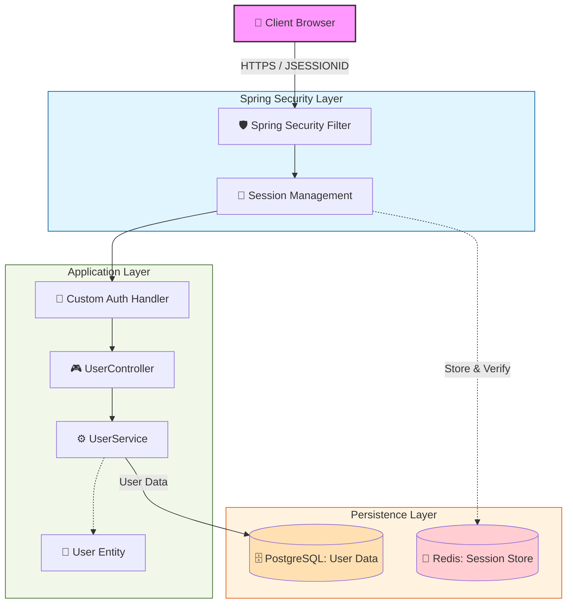

# Phase 1: 세션 기반 중앙 집중형 인증 아키텍처

이 문서는 프로젝트 초기 단계의 **세션 기반 인증 구조**를 설명합니다. 이 단계는 전통적인 웹 애플리케이션의 인증 방식을 따르며, 이후 Phase 2의 Stateless 아키텍처로 진화하기 위한 기초가 됩니다.

### ✅ Phase1 시스템 아키텍처 다이어그램 

---

### 🔍 주요 흐름 및 구성 요소 설명

1.  **Stateful 인증 (Session-based)**
    *   사용자가 로그인에 성공하면 서버는 세션 정보를 생성하고 **Redis**에 저장합니다.
    *   브라우저에는 `JSESSIONID`라는 세션 키를 쿠키로 발급합니다.
    *   서버는 모든 요청마다 쿠키의 ID를 Redis와 대조하여 사용자의 인증 상태를 확인합니다.

2.  **Redis 세션 저장소**
    *   메모리 기반 저장소인 Redis를 사용하여 세션 조회 속도를 극대화하고, 다중 서버 환경(Scale-out)에서도 세션 정보를 공유할 수 있는 구조를 갖췄습니다.

3.  **Spring Security Layer**
    *   `UsernamePasswordAuthenticationFilter`를 통해 전통적인 폼 기반 로그인을 처리하며, `SessionManagementConfigurer`를 통해 세션 정책을 관리합니다.

---

### ⚠️ Phase 1의 한계점 및 개선 방향
*   **서버 상태 의존성**: 인증을 위해 매번 Redis 조회가 필요하며, 세션이 만료되거나 Redis 서버에 문제가 생기면 모든 사용자의 로그인이 해제됩니다.
*   **확장성 제약**: 진정한 Stateless 구조가 아니므로 마이크로서비스 아키텍처(MSA)나 모바일 환경 대응에 한계가 있습니다.
*   **결정**: 이러한 한계를 극복하기 위해 Phase 2에서는 **JWT(JSON Web Token) 기반의 Stateless 인증**으로 전환합니다.