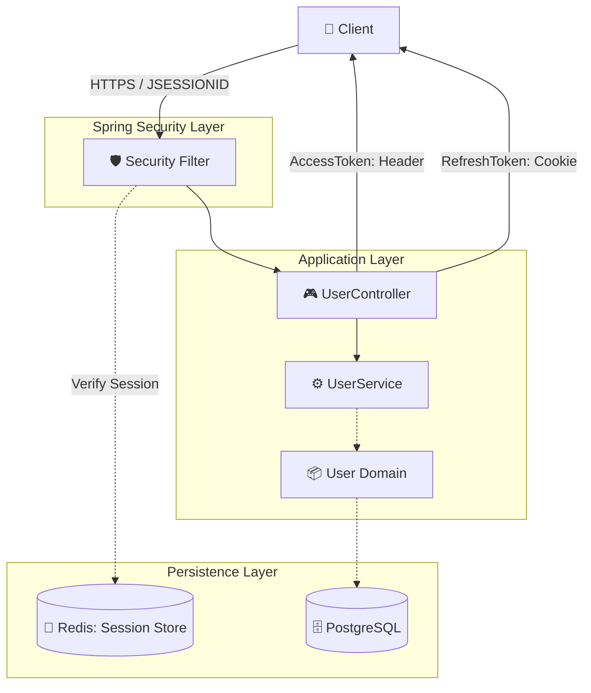
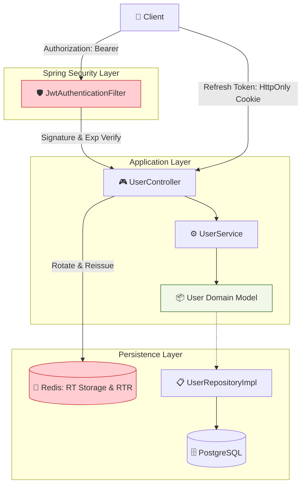

# Phase 2: Stateless JWT 인증 아키텍처

Phase 2에서는 서버의 상태(Session)를 완전히 제거하고, 모든 인증을 JWT(JSON Web Token)로 대체합니다. 특히 **보안성(HttpOnly Cookie)**과 **확장성(Stateless)**, 그리고 **제어권(Redis RT Storage)**을 동시에 확보하는 구조로 설계되었습니다.

---

## 1. Phase 2-1: 하이브리드 토큰 체계 도입
세션 방식을 기반으로 토큰 발급 로직을 통합하여 클라이언트에게 JWT(Access/Refresh)를 전달하는 기초 단계입니다.

---

## 2. Phase 2-2 & 2-3: RTR 기반 Stateless 인증 완성 (현재)
서버 세션을 제거하고, 매 요청마다 JWT를 검증합니다. **RTR(Refresh Token Rotation)**을 적용하여 보안 위협에 대응합니다.

### ✅ 최종 아키텍처 다이어그램

### 🔍 핵심 설계 전략

1.  **HttpOnly & Secure Cookie (Refresh Token)**
    *   XSS(Cross-Site Scripting) 공격에 노출되기 쉬운 LocalStorage 대신, JavaScript 접근이 불가능한 **HttpOnly 쿠키**에 Refresh Token을 저장하여 보안성을 강화했습니다.

2.  **RTR (Refresh Token Rotation)**
    *   새로운 Access Token을 발급받을 때마다 기존 Refresh Token을 무효화하고 **새로운 한 쌍의 토큰**을 재발급합니다.
    *   이는 토큰 탈취 시 공격자가 탈취한 토큰을 단 1회만 사용할 수 있게 제한하며, 비정상적인 중복 사용 감지 시 해당 유저의 모든 토큰을 즉시 무효화하는 근거가 됩니다.

3.  **Clean Layered Architecture (DIP 적용)**
    *   **Domain Model (`User`)**: 영속성 기술(JPA)에 의존하지 않는 순수 도메인 객체입니다.
    *   **Persistence Layer**: 인터페이스(`UserRepository`)를 통해 인프라의 세부 사항을 감춥니다. 이를 통해 향후 DB 교체나 기술 변경에 유연하게 대응할 수 있습니다.

4.  **Stateless Principle**
    *   모든 권한 정보가 토큰에 포함(Self-contained)되어 있으므로 서버는 사용자의 인증 상태를 메모리에 유지할 필요가 없습니다. 이는 서버의 수평적 확장(Scale-out)을 매우 용이하게 합니다.
