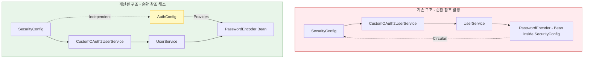

# Phase 3.5: 코틀린 전환 안정화 및 구조 개선 아키텍처

이 문서는 Java에서 Kotlin으로의 언어 전환 과정에서 발생한 구조적 결함을 개선하고, Kotlin의 언어적 이점을 극대화하기 위해 재설계된 아키텍처를 설명합니다.

## 1. 개요
- **목표**: 코틀린 전환 후 발생한 런타임/컴파일 오류 해결 및 서비스 간 순환 참조(Circular Dependency) 제거.
- **핵심 전략**:
  - **책임 분리(SoC)**: 인증 인프라(`PasswordEncoder`)와 보안 필터 체계(`SecurityFilterChain`) 설정을 분리.
  - **Null-Safety**: Kotlin의 Nullable 타입을 활용하여 Java의 `Optional` 남용을 줄이고 가독성 향상.
  - **생성자 주입 최적화**: Kotlin의 Primary Constructor를 활용한 불변성 확보.

## 2. 구조 개선 다이어그램 (순환 참조 해소)

---

## 3. 핵심 변경 사항

### 3.1. 설정 계층 분리 (`AuthConfig` 도입)
- **`PasswordEncoder` 독립**: 기존 `SecurityConfig` 내부에 존재하던 `PasswordEncoder` 빈 설정을 `AuthConfig`로 추출.
- **의존성 방향 단일화**: `UserService`가 더 이상 `SecurityConfig` 전체를 의존하지 않고, 필요한 `PasswordEncoder`만 의존하도록 개선.

### 3.2. 도메인 모델 코틀린화 (`User.kt`)
- **Primary Constructor**: 모든 필드를 생성자에서 정의하여 `Lombok` 의존성 제거 및 불변성(Immutable) 강화.
- **Default Arguments**: Java의 다중 생성자를 대체하여 유연한 객체 생성 지원.
- **Companion Object**: 정적 팩토리 메서드(`createSocialUser`)를 코틀린 스타일로 구현.

### 3.3. 예외 처리 고도화 (`GlobalExceptionHandler.kt`)
- **First-class Support for Nulls**: Java Stream과 Optional 대신 Kotlin의 `firstOrNull()`과 Elvis 연산자(`?:`)를 사용하여 코드가 간결해지고 타입 안전성이 강화됨.

---

## 4. 기대 효과
1. **빌드 안정성**: 빈 초기화 시점의 순환 참조 에러(`BeanCurrentlyInCreationException`)를 원천 차단.
2. **코드 품질**: 코틀린 관용구 적용으로 코드 라인 수가 줄어들고 유지보수성이 향상됨.
3. **테스트 용이성**: 생성자 주입을 명확히 함으로써 Mockito 등을 활용한 단위 테스트 작성이 용이해짐.
