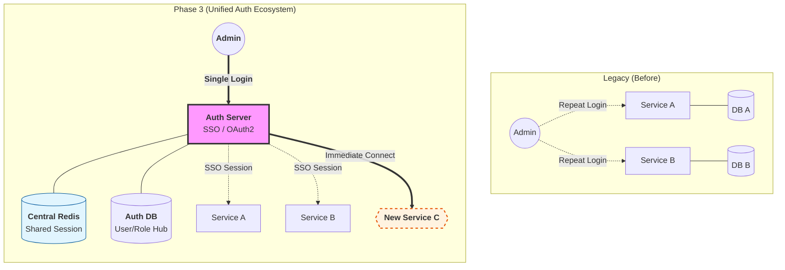
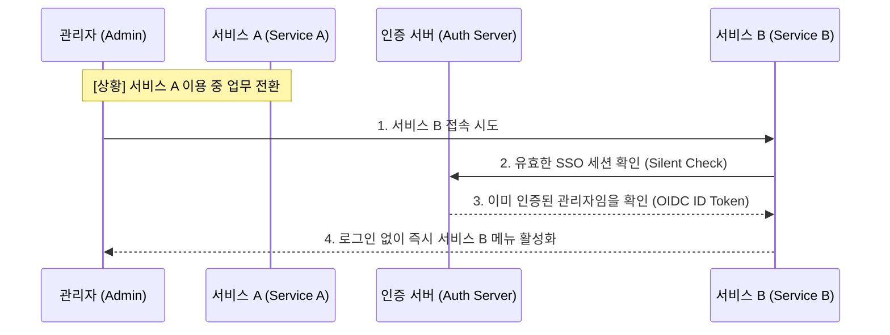

# Phase 3 Architecture: Service Integration & SSO Validation

Phase 3의 아키텍처는 파편화된 각 서비스(Service A, B, C)를 중앙 인증 서버(Auth Server)와 연결하여 **단일 진실의 원천(SSO)**을 실현하는 구조를 가집니다.

---

### 🗺️ 전사 통합 인증 아키텍처

---

### 🏗️ 핵심 설계 원칙 (Design Principles)

#### 1. 단일 진실의 원천 (Single Source of Truth)
- 모든 회원의 신원 확인(Identification)과 권한(Authorization)은 **Auth Server** 한 곳에서만 결정함.
- 개별 서비스는 별도의 회원 DB를 관리하지 않으며, Auth Server에서 제공하는 신원 정보를 기반으로 동작함.

#### 2. 무중단 SSO 세션 동기화 (Redis-based Session Clustering)
- 사용자가 한 번 로그인하면, 해당 세션 정보는 **Central Redis**에 저장되어 모든 연동 서비스가 실시간으로 공유함.
- 서버 장애나 재시작 시에도 Redis를 통해 인증 상태를 유지함으로써 관리자 경험의 단절을 방지함.

#### 3. 확장 가능한 표준 인터페이스 (Standardized OAuth2/OIDC)
- 서비스 연동 시 자체 인증 로직을 구현하지 않고, 표준 OAuth2/OIDC 인터페이스를 따름으로써 신규 서비스 도입 비용을 최소화함.

---

### 🔄 SSO 시퀀스 흐름 (Service A to Service B)

---

### 🛠️ 기술 스택 (Tech Stack)
- **Central Auth**: Spring Boot + Spring Security OAuth2
- **Session Hub**: Redis (Session Clustering)
- **Data Store**: PostgreSQL (Central Identity)
- **Client Protocol**: OAuth2 Client Library (Standard)

---

### 🔗 연관 자료
- **[Phase 3 Detail](./../phase/phase3.md)**: 단계별 상세 로드맵
- **[Design Notes](./../phase/PHASE3_DESIGN_NOTES.md)**: SSO 구현 시의 기술적 결정 사항
- **[SSO Implementation Test](../../src/test/java/com/pebble/baseAuth/config/oauth2/CustomOAuth2UserServiceTest.java)**: 실제 연동 검증 테스트 코드
