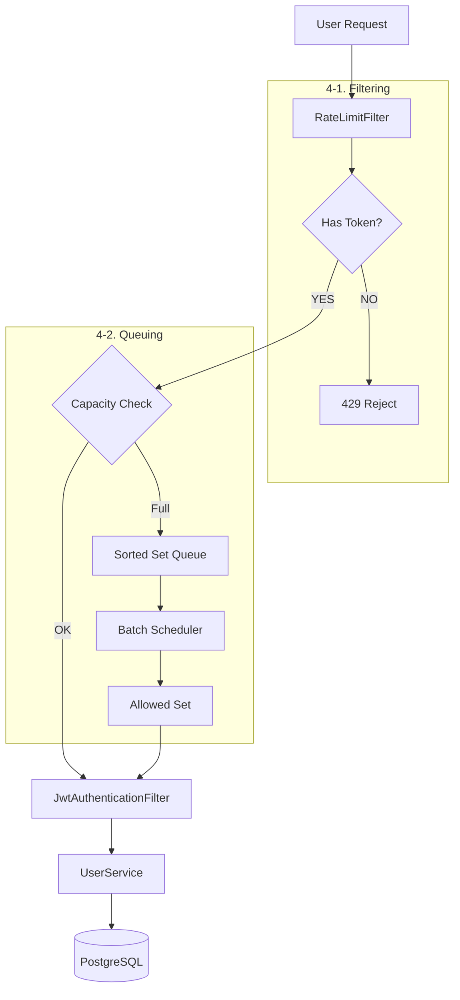

# Phase 4 Architecture: Smart Gateway

본 문서는 대용량 트래픽 상황에서 시스템의 생존을 보장하기 위한 **'Smart Gateway(Filtering)'** 계층의 설계를 설명합니다.

### 1. 개요
기존의 형태는 모든 요청을 DB 조회 및 CPU 연산으로 처리하려 했으나, 이는 트래픽 폭주 시 서버 자원의 급격한 고갈을 초래합니다.
Phase 4에서는 최외곽 필터 계층에서 비정상 트래픽을 선제적으로 차단합니다.

### 2. 아키텍처 다이어그램

### 3. 핵심 컴포넌트
1.  **RateLimitFilter**: 모든 HTTP 요청의 최입구에서 IP를 식별하고 요청 빈도를 체크합니다.
2.  **Bucket4j Engine**: 'Token Bucket' 알고리즘을 사용하여 허용 가능한 트래픽 범위를 계산합니다.
3.  **Local/Distributed Cache**: 버킷의 상태를 저장합니다. 현재는 `ConcurrentHashMap` 기반이나, 향후 `Redisson`을 통해 분산 환경으로 확장합니다.

### 4. 데이터 흐름
1.  사용자 요청 발생 (Client IP 추출).
2.  IP별 전용 '버킷' 확인.
3.  버킷에 토큰이 남아있다면 1개 소모 후 통과.
4.  토큰이 없다면 대기열(Queue) 진입 여부를 판단합니다.
5.  대기열이 가득 찬 경우 즉시 응답 반환 (비즈니스 로직 진입 차단).

**배치 처리**: 백그라운드 스케줄러가 1초마다 상위 N명의 유저를 '진입 허용(Set)' 명부로 이동합니다.
**폴링 확인**: 클라이언트가 주기적으로 상태를 확인하다가 `ALLOWED` 상태가 되면 실제 비즈니스 로직(로그인)을 수행합니다.
