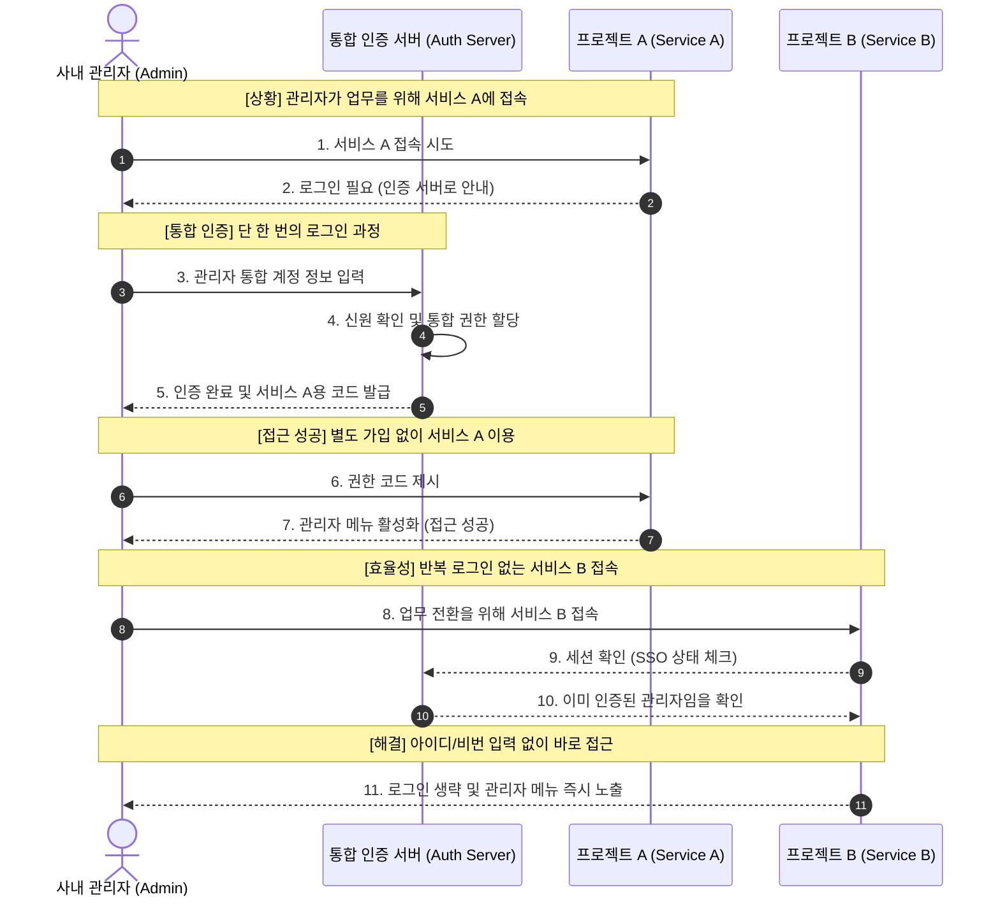

# Phase 3 설계 노트: Service Integration & SSO Validation

**작성자**: 아키텍트 / 백엔드 리드
**일자**: 2026-04-13

## 1. 개요
Phase 3의 핵심 설계 목표는 파편화된 서비스(A, B, C)를 하나의 인증 생태계로 통합하고, 관리자가 체감할 수 있는 실질적인 SSO(Single Sign-On)를 구현하는 것입니다. 본 문서는 이 과정에서의 기술적 결정과 검증 전략을 기록합니다.

---

## 2. SSO 메커니즘 설계 (Core Logic)

### 2.1. 중앙 집중식 세션 관리 (Shared Session via Redis)
- **설계**: 각 서비스는 독립적인 세션을 가지지 않고, Redis를 공유 저장소로 사용하여 인증 상태를 동기화함.
- **결정 배경**: 서비스 A에서 로그인한 상태가 서비스 B로 즉시 전파되어야 함. 쿠키 기반의 JWT를 사용하되, Redis를 통해 화이트리스트 세션을 관리하여 즉각적인 권한 회수(Revocation)가 가능하도록 함.

### 2.2. OAuth2 Authorization Code Flow 최적화
- **설계**: 내부 서비스 간 연동 시에는 `prompt=none` 옵션을 활용하여 사용자의 명시적 동의 없이도 백그라운드에서 토큰을 갱신.
- **결정 배경**: 관리자가 서비스 A에서 B로 이동할 때마다 '동의함' 버튼을 누르는 것은 UX 저해 요소임. 신뢰할 수 있는 사내 서비스 간에는 이 과정을 자동화하여 "물 흐르듯 연결되는" 경험 제공.

---

## 3. 통합 권한 구조 (Unified RBAC)

### 3.1. 서비스별 권한 매핑 (Role Mapping)
- **설계**: 중앙 서버의 `ROLE_ADMIN`은 각 서비스에서 필요한 세부 권한(예: 서비스 A의 `EDITOR`, 서비스 B의 `VIEWER`)으로 자동 매핑됨.
- **결정 배경**: 모든 서비스가 동일한 권한 체계를 가질 필요는 없지만, 중앙에서 제어는 가능해야 함. JWT Claim에 서비스별 권한 맵을 포함시켜 전달하는 방식을 채택.

---

## 4. SSO 검증 시나리오 (Validation Strategy)

| 시나리오 | 검증 포인트 | 기대 결과 |
|:---|:---|:---|
| **최초 로그인** | 서비스 A 접속 시 인증 서버로 리다이렉트 및 로그인 | 서비스 A 메인 화면 진입 성공 |
| **서비스 전환 (SSO)** | 로그인 상태에서 서비스 B 주소 직접 입력 접속 | 로그인 폼 없이 즉시 서비스 B 진입 |
| **권한 즉시 반영** | 중앙 서버에서 권한 하향 조정 후 서비스 A 새로고침 | 즉시 '접근 권한 없음' 메시지 노출 |
| **전역 로그아웃** | 서비스 B에서 로그아웃 시도 | 서비스 A에서도 세션 만료 확인 |

---

## 5. 현재 설계의 한계 및 개선 과제

1. **도메인 제약**: 현재는 동일 Root 도메인 하에서만 쿠키 공유를 통한 SSO가 원활함. 타 도메인 확장을 위한 OIDC 표준 강화 필요.
2. **트래픽 집중**: 모든 서비스의 권한 검증 요청이 인증 서버로 집중됨. 이를 해결하기 위해 Phase 4에서 'Waiting Room(대기열)' 및 'Rate Limit' 도입 예정.

---

## 6. 향후 계획
- **SSO 대시보드**: 관리자가 현재 활성화된 자신의 모든 서비스 세션을 한눈에 보고 제어할 수 있는 UI 구축.
- **자동 로그아웃 동기화**: 한 곳에서 로그아웃 시 연동된 모든 브라우저 탭의 세션을 종료시키는 Webhook 메커니즘 도입.

---

---